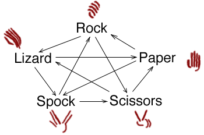

 
# rock-paper-scissors-spock-lizard in rust

[](https://travis-ci.org/gdamjan/rpssl-rust)

written in Rust, using [Actix and Actix-Web](https://actix.rs/).


This demo is based on a similar [Erlang demo](https://github.com/gdamjan/erlang-rpssl-comet) I did couple of years back. It's my first Rust code too.

A thin http layer is responsible just for parsing the POST data, and making a proper Http response.

```
GET / -> main page
POST / -d '' -> Redirect to /<uuid>/

GET /<uuid>/ -> game page
POST /<uuid>/attack -d attack=scissors|rock|paper|spock|lizard ->
    long poll,
      -> sends attack to game actor
      <- game actor only returns when it has 2 hands played
    returns result of the play
```

A central GameActor has all the pending hands played in all the games (denoted as uuid, part of the url).
The GameActor gets async messages and only responds when both hands are played in a game.

When two users play a hand, the get a response from the long poll request with the game result.

This is a simple demo, so there are no sessions, no timeout handling, etc. The demo can mis-behave in different edge
cases.

# Test

You can play with curl:

```
curl --data '{ "attack": "Spock"}' -H 'Content-Type: application/json'  http://localhost:8088/test-game/attack -i
# and in another terminal
curl --data '{ "attack": "Lizard"}' -H 'Content-Type: application/json'  http://localhost:8088/test-game/attack -i
```
